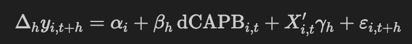

# Honors Thesis Replication Repository: ARIMA-Based Bootstrap for IV–Local Projections

This repository accompanies **Yesui Nyamchuluun’s Honors Thesis (University of Minnesota, 2025)** titled  
> *“State-Dependent Fiscal Policy Effects: ARIMA-Based Bootstrap Meets Local Projections.”*
> 
(Step-by-step replication at the bottom of the file)

The project replicates and extends the econometric framework of **Jordà, Schularick, and Taylor (2020)** (*Journal of Monetary Economics*), translating their Stata-based IV–Local Projection (IV–LP) design into a fully transparent, reproducible **Python implementation**.  
It introduces an **ARIMA-based bootstrap** procedure to evaluate finite-sample inference robustness in estimating fiscal multipliers across different business-cycle regimes.

---
## Methodological Summary

### 1. Data Preparation  
- Combines fiscal, JST, and CAPB datasets at the country–year level.  
- Constructs growth, fiscal consolidation, and cumulative response variables.  
- Applies the **Hodrick–Prescott filter (λ = 400)** to extract cyclical components of GDP and define **boom** and **slump** states.  

### 2. ARIMA Model Selection  
- Fits ARIMA(p,0,q) models to detrended GDP residuals.  
- Selects a single common specification minimizing **AIC/BIC**, saved in `common_arima_order.json`.

### 3. Instrumented Local Projections (IV–LP)

The estimated regression takes the form:

  

  using 2SLS regressions instrumenting *dCAPB* with within-country demeaned *size*.  
- Includes controls (_x₁–x₆_) consistent with the baseline JST specification.

### 4. ARIMA-Based Bootstrap  
- Simulates residual paths under the fitted ARIMA process.  
- Recomputes IV–LP regressions for each draw to obtain empirical χ² distributions.  
- Provides **joint** and **horizon-specific** bootstrap p-values under finite-sample uncertainty.

---

## Key Outputs

| Subsample       | Observed χ² | Standard χ² (95%) for df = 5 | Bootstrap 95th Percentile | Bootstrap p-value | Decision             |
|------------------|-------------|--------------------|----------------------------|-------------------|----------------------|
| Full Sample      | 19.454      | 11.070             | 23.080                     | 0.069*            | Do not reject H₀     |
| Boom             | 58.085      | 11.070             | 15.524                     | 0.000***          | Reject H₀            |
| Slump            | 17.552      | 11.070             | 25.071                     | 0.099*            | Do not reject H₀     |

All results are automatically exported to  
`output/bootstrap_joint_chi2_summary.csv`.

## How to Replicate the Results

1. Set up a Python environment and install the packages used in the scripts inside the `computation` folder.

2. Make sure all input data files (`JSTdatasetR6.dta`, `dcapb.dta`, `fiscal_consolidation_v032023.dta`, and `iv_data_corrected.csv`) are located in the `input` directory.

3. First, run `replicate_jorda_taylor_IVLP.py` (in `computation/`) to reproduce the baseline Jordà–Schularick–Taylor IV–Local Projection results and the replicated impulse response figure.

4. Next, run `arima_sanity_and_selection.py` to choose and check the ARIMA specification used for the bootstrap procedure.

5. Finally, run `ivlp_bootstrap_main.py` to perform the ARIMA-based bootstrap, generate the empirical χ² distributions, and produce the main tables and bootstrap figure saved in the `output` and `figures` folders.

---

### Yesui Nyamchuluun advised by Prof. Hannes Malmberg
yesui.nyamchuluun@gmail.com

University of Minnesota, Department of Economics, Class of 2025. 
